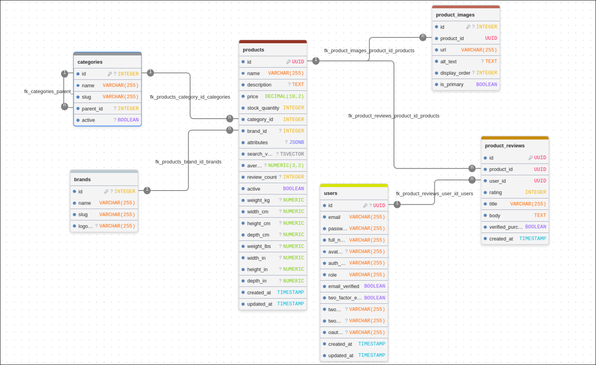

# i-love-shopping

A B2C e-commerce platform for Japanese homeware — ceramics, stationery, kitchenware and tea,
sourced from small makers.

Built in three projects. **This repository is Project 1 (Foundation):** secure user accounts, a
relational database designed for growth, and the product catalog that Projects 2 (Commerce) and
3 (Experience) build on. The assignment brief is kept verbatim at
[docs/ASSIGNMENT.md](docs/ASSIGNMENT.md).

> **Status — read this first.** Authentication is complete and tested end to end. The catalog
> domain and the customer-facing UI are in progress. See [Project status](#project-status) for the
> honest line-by-line breakdown before reviewing.

---

## Quick start

Docker is the only prerequisite.

```sh
git clone <this-repo> && cd i-love-shopping1
./start.sh
```

That builds and starts all five containers. First run takes a few minutes (Maven and Bun both
resolve dependencies); subsequent runs are cached.

| | URL |
|---|---|
| App | <http://localhost:5173> |
| API | <http://localhost:8080> |
| MailHog (catches all outbound dev email) | <http://localhost:8025> |
| Postgres | `localhost:5432` |
| Redis | `localhost:6379` |

```sh
./start.sh down     # stop
./start.sh reset    # stop and delete volumes (wipes the database)
docker compose logs -f backend
```

`docker-compose.yml` carries a working development default for every variable, so a bare
`docker compose up --build` works too. `./start.sh` additionally writes a `.env` from
`.env.example` to give you one place to edit. `.env` is gitignored and holds no real secrets in
development.

---

## Usage guide

A walkthrough of everything currently working. All of it can be driven from `curl`; the API is
also reachable through the app origin at `http://localhost:5173` (see [Request flow](#request-flow)).

### Register and log in

```sh
curl -X POST http://localhost:8080/auth/register \
  -H 'Content-Type: application/json' \
  -d '{"email":"you@example.com","password":"correct horse battery staple","fullName":"Your Name"}'

curl -i -X POST http://localhost:8080/auth/login \
  -H 'Content-Type: application/json' \
  -d '{"email":"you@example.com","password":"correct horse battery staple"}'
```

The login response body carries the **access token**. The **refresh token** comes back as an
`httpOnly; Secure; SameSite=Strict; Path=/auth` cookie — it is never readable by JavaScript.

### Refresh rotation (single-use)

```sh
curl -i -X POST http://localhost:8080/auth/refresh -b 'refresh_token=<the cookie value>'
```

Every refresh issues a **new** refresh token and destroys the old one. Replay the same cookie a
second time and it is rejected — the Redis key is already gone. This is the behaviour to test at
review; see [Security design](#security-design) for why it is done with a Lua script.

### Password reset via email

`POST /auth/forgot-password` with an email address, then open **MailHog at
<http://localhost:8025>** to read the message and follow the reset link. Completing a reset
revokes every refresh token that user holds.

### Two-factor authentication

`POST /auth/2fa/setup` (authenticated) returns an `otpauth://` URI — render it as a QR code or
paste it into Google Authenticator / Authy. `POST /auth/2fa/enable` with a code from the app turns
it on and returns eight single-use backup codes. From then on `POST /auth/login` returns a
challenge instead of tokens, and real tokens are only issued by `POST /auth/2fa/login`.

### CAPTCHA

Off by default so review does not depend on Google keys. Set `RECAPTCHA_ENABLED=true` plus
`RECAPTCHA_SITE_KEY` / `RECAPTCHA_SECRET_KEY` in `.env` to require a verified reCAPTCHA token on
registration.

### Google OAuth

Set `GOOGLE_CLIENT_ID` in `.env`, then `POST /auth/oauth/google` with a Google ID token. An email
already registered with a password cannot be silently taken over by the OAuth flow — it returns a
409 rather than merging the accounts.

---

## API reference

All request bodies are JSON and validated at the boundary; failures return `400` with a per-field
error map. Unknown fields are rejected outright (mass-assignment guard).

### Public

| Method | Path | Purpose |
|---|---|---|
| `POST` | `/auth/register` | Create an account. Optional CAPTCHA token. |
| `POST` | `/auth/login` | Email + password. Returns tokens, or a 2FA challenge. |
| `POST` | `/auth/2fa/login` | Exchange a 2FA challenge + TOTP code for tokens. |
| `POST` | `/auth/oauth/google` | Exchange a Google ID token for tokens. |
| `POST` | `/auth/refresh` | Rotate the refresh cookie, get a new access token. |
| `POST` | `/auth/forgot-password` | Send a reset email. Always `204`, so it cannot be used to enumerate accounts. |
| `POST` | `/auth/reset-password` | Consume a reset token, set a new password, revoke all sessions. |

### Authenticated (`Authorization: Bearer <access token>`)

| Method | Path | Purpose |
|---|---|---|
| `POST` | `/auth/logout` | Blocklist the access token's JTI, destroy the refresh token. |
| `POST` | `/auth/2fa/setup` | Get an `otpauth://` provisioning URI. |
| `POST` | `/auth/2fa/enable` | Verify a TOTP code, enable 2FA, return backup codes. |
| `POST` | `/auth/2fa/disable` | Verify a TOTP code, disable 2FA. |

Errors are shaped consistently by a single `@RestControllerAdvice`:

```json
{ "error": "validation_failed", "fields": { "email": "must be a well-formed email address" } }
```

Stack traces, SQL and internal paths never reach a response body.

---

## Database

PostgreSQL 16. The full diagram:



Schema is owned by Flyway migrations in `backend/src/main/resources/db/migration/`, applied
automatically on startup. Migrations are append-only — a committed `V*.sql` is never edited.

### Entities

| Table | Key | Notes |
|---|---|---|
| `users` | `UUID` | Unique email, BCrypt hash, `LOCAL`/`GOOGLE`/`FACEBOOK` provider, role, 2FA secret + backup codes |
| `categories` | `INTEGER` | Self-referencing `parent_id` for an arbitrary-depth tree |
| `brands` | `INTEGER` | Name, unique slug, logo |
| `products` | `UUID` | Price `DECIMAL(10,2)`, stock, category, brand, `JSONB` attributes, both metric and imperial weight/dimensions, generated `tsvector`, denormalised rating |
| `product_images` | `INTEGER` | Ordered, one flagged `is_primary` |
| `product_reviews` | `UUID` | Rating `CHECK BETWEEN 1 AND 5`, one review per user per product |

### Design decisions worth asking about

- **Three different FK delete rules, deliberately.** `products.category_id` is `RESTRICT` — a
  category with products in it must not vanish. `products.brand_id` is `SET NULL` — losing a brand
  should orphan the product, not delete it. `product_images` and `product_reviews` are `CASCADE` —
  they have no meaning without their product.
- **`search_vector` is `GENERATED ALWAYS ... STORED`,** so Postgres maintains it on write rather
  than recomputing `to_tsvector` on every query. Costs disk, saves per-query CPU.
- **`average_rating` and `review_count` are denormalised onto `products`** so that sorting the
  catalog by rating is an index scan, not an aggregate over `product_reviews`.
- **A partial unique index** (`uq_categories_root_name WHERE parent_id IS NULL`) enforces unique
  names among root categories while still allowing the same subcategory name under two parents.
- **Constraints live in the database, not only in DTOs.** Every `@NotBlank` has a `NOT NULL`, every
  `@Size(max=N)` a `VARCHAR(N)`, every range a `CHECK`. Application checks are hopes; database
  constraints are facts.

### ACID

Postgres gives all four out of the box, and the design leans on them: **atomicity** so a
multi-statement operation such as "reset password and revoke every session" cannot half-apply;
**consistency** through the FK, `CHECK` and `UNIQUE` constraints above; **isolation** so two
concurrent registrations of the same email cannot both succeed — the `UNIQUE` index makes one of
them fail, and the service catches `DataIntegrityViolationException` to turn it into a clean `409`
instead of a race; **durability** through the WAL, so a committed order survives a crash.

### Scaling path

Read replicas for catalog reads, connection pooling (HikariCP, already in use), partitioning
`product_reviews` by product once it is large, and `JSONB` for per-category attributes so new
product types do not need a migration. Redis already absorbs the hot, short-lived, high-churn
data that would otherwise hammer Postgres. `SearchService` is an interface with a Postgres
implementation so search can move to Elasticsearch in Project 3 without touching its callers.

---

## Architecture

**Modular monolith.** One Spring Boot application, split by *domain* rather than by layer:

```
com.iloveshopping/
├── user/       User, UserRepository, UserService
├── auth/       JWT, refresh rotation, 2FA, CAPTCHA, OAuth, password reset
├── catalog/    products, categories, brands, search   (in progress)
├── config/     SecurityConfig, PasswordConfig, RestClientConfig, GoogleOAuthConfig
└── exception/  GlobalExceptionHandler, ErrorResponse
```

Each domain owns its own controller, service, repository, entity and exceptions. Cross-domain
access goes through service interfaces — never repository to repository.

**Why not microservices:** at this size they would add network calls, distributed transactions and
deployment overhead to buy independent scaling nobody needs yet. The domain boundaries here are
real, so if one domain ever does need to be extracted, the seam is already cut. **Why not a plain
layered monolith:** a `controllers/ services/ repositories/` split makes every feature a change in
three packages and lets domains reach into each other's data unnoticed.

**Stateless processes.** No `HttpSession`, no in-memory user state, no static maps. Every
session-like thing lives in Redis, so any instance can serve any request and the app scales
horizontally.

### Request flow

```
browser :5173  ──►  nginx (frontend container)
                      │
                      ├─ /                    SPA bundle, with a try_files fallback
                      ├─ /images/…            product images off the shared volume
                      └─ /auth/… /products/…  proxied to backend:8080
                                                   │
                                    ┌──────────────┼──────────────┐
                                 postgres        redis         mailhog
```

nginx serves the app *and* proxies the API, so the browser only ever talks to one origin. That
means **no CORS anywhere in the stack** and no cross-origin credential sharing to get wrong. The
proxy passes paths through verbatim rather than rewriting them under an `/api` prefix, because the
refresh cookie is scoped `Path=/auth` and a rewritten prefix would stop the browser from ever
sending it back. Port `8080` stays published so the API can also be driven directly with `curl`.

### Storage map

| Store | Holds |
|---|---|
| Postgres | Durable user, product, category, brand, image and review data |
| Redis | Refresh tokens, the access-token JTI blocklist, pending 2FA challenges, password-reset tokens — all TTL'd |
| Docker volume `product_images_data` | Image bytes, written by the backend, served by nginx. An S3 `StorageService` implementation replaces this for production. |

---

## Security design

- **Access token: in memory only.** A JavaScript module variable, never `localStorage` or
  `sessionStorage`, so an XSS payload cannot read it out of storage. On page reload the app calls
  `/auth/refresh` to rehydrate. Short-lived (15 minutes by default, `JWT_ACCESS_TTL`).
- **Refresh token: `httpOnly` cookie,** scoped `Path=/auth`, `SameSite=Strict`, `Secure`. Not
  reachable from JavaScript at all. Seven-day TTL (`JWT_REFRESH_TTL`).
- **Rotation is atomic.** `TokenStoreService` swaps the old token for a new one inside a **Redis
  Lua script**, so read-old / delete-old / write-new is one indivisible operation. Done as three
  separate Redis calls, two requests arriving a few milliseconds apart could both validate the same
  token and both get fresh ones. Under the Lua script, the second one finds the key gone and is
  rejected.
- **Revocation for both token types.** Logout writes the access token's `jti` to a Redis blocklist
  with a TTL equal to the token's remaining lifetime, and `JwtAuthenticationFilter` checks it on
  every request. The refresh token is deleted outright.
- **Password reset revokes everything.** Every refresh token for that user is destroyed, via the
  `refresh_tokens_user:{userId}` set — so a reset actually locks an attacker out.
- **No PII in the JWT.** Payload is `sub`, `role`, `iat`, `exp`, `jti`. No email, no name.
- **Identity is not authorisation.** A valid JWT proves who you are; the service and database still
  check that the resource being touched belongs to that `sub`.
- **Passwords are NFC-normalised before BCrypt**, on both register and login, so accented
  characters are never silently rejected or mismatched.
- **CSRF is disabled deliberately, not carelessly.** State-changing requests carry a `Bearer`
  header, which browsers do not attach automatically, and the one cookie in play is
  `SameSite=Strict` and scoped to `/auth`.
- **Every secret is an environment variable.** No secret is committed; `.env.example` holds names
  and placeholders only.

---

## Testing

```sh
cd backend && mvn verify     # unit + integration; Testcontainers needs Docker running
cd frontend && bun test
```

Integration tests run against **real Postgres and Redis in Testcontainers**, never H2 — H2 lies
about the Postgres-specific features this schema depends on (`JSONB`, `tsvector`, generated
columns).

| Kind | Covers |
|---|---|
| Unit | `JwtServiceTest` (generation, validation, expiry), `TokenStoreServiceTest` (rotation, single-use), `TwoFactorServiceTest`, `PasswordResetServiceTest`, `CaptchaServiceTest`, `GoogleTokenVerifierTest`, `UserServiceTest` |
| Integration | `AuthControllerIT`, `PasswordResetControllerIT`, `TwoFactorControllerIT` — full Spring context over MockMvc, covering `400`/`401`/`403`/`409` paths, not just happy paths |
| Manual | CAPTCHA, Google OAuth and the 2FA enrolment flow, per the brief |

Gaps are listed honestly under [Project status](#project-status).

---

## Project status

What a reviewer can and cannot exercise today.

**Working and tested**

- Email + password registration and login, with server-side validation
- Google OAuth login
- reCAPTCHA on registration (opt-in via env)
- JWT access tokens in memory, refresh tokens as `httpOnly` cookies
- Single-use refresh rotation, atomic in Redis
- Revocation of both token types
- Password recovery and reset by email, through MailHog
- Optional user-enabled 2FA with TOTP and backup codes
- Full schema and ERD for every Project 1 entity
- Unit + API integration test suites for all of the above
- One-command Docker startup

**Not built yet**

- **Catalog domain** — the tables exist; the entities, repositories, services, controllers and
  their tests do not. No product browsing, no category tree endpoint.
- **Search** — no `SearchService` implementation, so no faceted search, no autocomplete, no
  relevance/price/rating sorting. The generated `tsvector` column is in place; the GIN index and
  `pg_trgm` autocomplete index are still to be added as a migration.
- **Product image upload and serving** — nginx is configured to serve `/images/`, but nothing
  writes to the volume yet.
- **Frontend** — the landing page renders. No auth screens, no Redux store, no Axios interceptor,
  no React Query wiring, no catalog UI, and no frontend tests.
- **Security test suite** — `InputValidationTest` (injection probes, oversized payloads, deep JSON,
  path traversal, mass assignment) is specified but not written.
- **Seed data** — the catalog is empty, so there is nothing to browse even once the endpoints land.

Planned order of work is in [claude-docs/BUILD_ORDER.md](claude-docs/BUILD_ORDER.md).

---

## Configuration

Every value is an environment variable, per [12-factor](https://12factor.net). Defaults in
`docker-compose.yml` are development-only.

| Variable | Default | Purpose |
|---|---|---|
| `POSTGRES_DB` / `POSTGRES_USER` / `POSTGRES_PASSWORD` | `iloveshopping` / `app` / `changeme` | Database credentials |
| `DATABASE_URL` | `jdbc:postgresql://postgres:5432/iloveshopping` | JDBC URL; host is the compose service name |
| `REDIS_URL` | `redis://redis:6379` | Token store |
| `JWT_SECRET` | dev placeholder | Signing key. **Must be replaced outside development.** |
| `JWT_ACCESS_TTL` / `JWT_REFRESH_TTL` | `PT15M` / `P7D` | Token lifetimes (ISO-8601 durations) |
| `SMTP_HOST` / `SMTP_PORT` / `MAIL_FROM` | `mailhog` / `1025` / `noreply@iloveshopping.local` | Outbound mail |
| `FRONTEND_RESET_URL` | `http://localhost:5173/reset` | Base of the link in reset emails |
| `GOOGLE_CLIENT_ID` | empty | Google OAuth; the flow is inert until set |
| `RECAPTCHA_ENABLED` / `RECAPTCHA_SITE_KEY` / `RECAPTCHA_SECRET_KEY` | `false` / empty / empty | CAPTCHA on registration |
| `TWO_FACTOR_ISSUER` | `i-love-shopping` | Label shown in authenticator apps |
| `FRONTEND_PORT` / `BACKEND_PORT` | `5173` / `8080` | Published host ports |

A missing required variable fails the application at boot rather than at first use. That is
intentional.

---

## Troubleshooting

**Ports already in use.** Set `FRONTEND_PORT`, `BACKEND_PORT`, `POSTGRES_PORT` or `REDIS_PORT` in
`.env` and restart.

**Backend exits on startup.** Almost always Flyway hitting a database left over from an older
schema. `./start.sh reset` drops the volumes and starts clean.

**No reset email arrives.** Nothing leaves the machine in development — every message is captured
by MailHog at <http://localhost:8025>.

**Reach the app at `localhost`, not a LAN IP.** The refresh cookie is marked `Secure`, and browsers
only allow that over plain HTTP for `localhost`.

**`mvn verify` fails to start containers.** Testcontainers needs a running Docker daemon and the
current user in the `docker` group.

---

## Repository layout

```
├── start.sh                one-command startup
├── docker-compose.yml      postgres, redis, mailhog, backend, frontend
├── .env.example            every variable, with placeholders
├── backend/                Spring Boot 4 · Java 21
│   └── src/main/resources/db/migration/   Flyway migrations
├── frontend/               React 18 · TypeScript · Vite · Bun
│   └── nginx.conf          SPA fallback, API proxy, image serving
├── docs/                   ERD, assignment brief
└── claude-docs/            design and build notes
```
